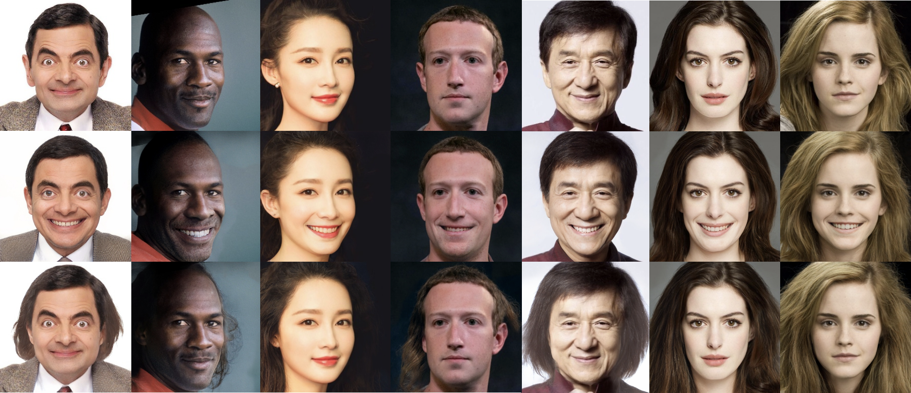

# Oh-My-Face

 [](https://colab.research.google.com/github/P2Oileen/oh-my-face/blob/main/oh-my-face.ipynb)
This project is based on [StyleCLIP](https://github.com/orpatashnik/StyleCLIP), [RIFE](https://github.com/hzwer/arxiv2020-RIFE), and [encoder4editing](https://github.com/omertov/encoder4editing), which aims to expand human face editing via Global Direction of StyleCLIP, especially to maintain similarity during editing. 

StyleCLIP is an excellent algorithm that acts on the latent code of StyleGAN2 to edit images guided by texts. Global Direction uses models such as e4e to convert images into latent codes and then further editing. However, this conversion causes information loss of the original image and dissimilarities.

Thus, we use the optical flow model to detect the change in different regions between the StyleCLIP generated image and the original image, sample more from the original in slightly-edited areas, then use frame interpolation to perform weighted fusion, which is simple yet efficient.

We will further release weights for cat face editing, containing cat facial landmark recognition from [pycatfd](https://github.com/marando/pycatfd) and e4e-cat model. e4e-cat is trained via [afhq-cat dataset](https://github.com/clovaai/stargan-v2#animal-faces-hq-dataset-afhq) and [StyleGAN2-cat](https://github.com/NVlabs/stylegan2) weights. [StyleGAN2-pytorch/convert_weights.py](https://github.com/rosinality/stylegan2-pytorch/blob/master/convert_weight.py) is used to convert the tensorflow weights.

## Usage

#### Prerequisites

* NVIDIA GPU + CUDA11.0 CuDNN
* Python 3.6

#### Installation

* Clone this repository

```bash
git clone https://github.com/P2Oileen/oh-my-face
```

* Dependencies

To install all the dependencies, please run the following commands.

```bash
wget https://developer.nvidia.com/compute/cuda/10.0/Prod/local_installers/cuda-repo-ubuntu1604-10-0-local-10.0.130-410.48_1.0-1_amd64 -O cuda-repo-ubuntu1604-10-0-local-10.0.130-410.48_1.0-1_amd64.deb
dpkg -i cuda-repo-ubuntu1604-10-0-local-10.0.130-410.48_1.0-1_amd64.deb
apt-key add /var/cuda-repo-10-0-local/7fa2af80.pub
apt-get update
apt-get -y install gcc-7 g++-7
apt-get -y install cuda 

export PATH=/usr/local/cuda/bin${PATH:+:${PATH}}
export LD_LIBRARY_PATH=/usr/local/cuda/lib64\${LD_LIBRARY_PATH:+:${LD_LIBRARY_PATH}}
export CUDA_HOME=/usr/local/cuda

pip install tensorflow-gpu==1.15.2
pip install ftfy regex tqdm gdown
pip install git+https://github.com/openai/CLIP.git
pip install torch==1.7.1+cu110 torchvision==0.8.2+cu110 torchaudio==0.7.2 -f https://download.pytorch.org/whl/torch_stable.html

wget https://github.com/ninja-build/ninja/releases/download/v1.8.2/ninja-linux.zip
sudo unzip ninja-linux.zip -d /usr/local/bin/
sudo update-alternatives --install /usr/bin/ninja ninja /usr/local/bin/ninja 1 --force
```

* Download Weights
Currently, We only provide weights for human face editing, PLEASE wait for further weights.
```
cd oh-my-face
wget https://drive.google.com/file/d/1efFoGShtZhcd6SCxOPu3AMbKZus478au/view?usp=sharing
tar -zxvf ffhq.tar.gz
mv ffhq src/
wget https://drive.google.com/file/d/1bXhWOnwCTTXTz7T7zJ1iXA717tyj-n3U/view?usp=sharing
tar -zxvf weights-face.tar.gz
mv weights src/
```

#### Edit image via oh-my-face
```
python3 run.py \
--input_dir='input.jpg' \ # Path to your input image
--output_dir='output.jpg' \ # Path to output directory
--option_beta=0.15 \ # Range from 0.08 to 0.3, corresponds to the disentanglement threshold
--option_alpha=4.1 \ # Range from -10.0 to 10.0, corresponds to the manipulation strength
--option_gamma=3 \ # Range from 1 to 10, corresponds to RIFE's sample strength
--neutral='face' \ # Origin description
--target='face with smile' \ # Target description
```
